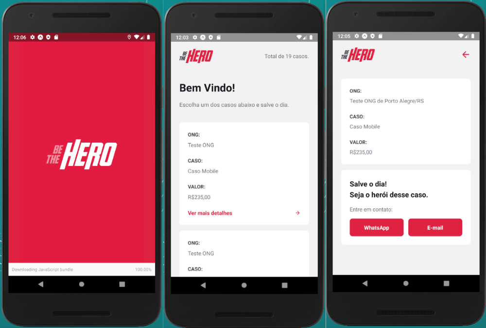
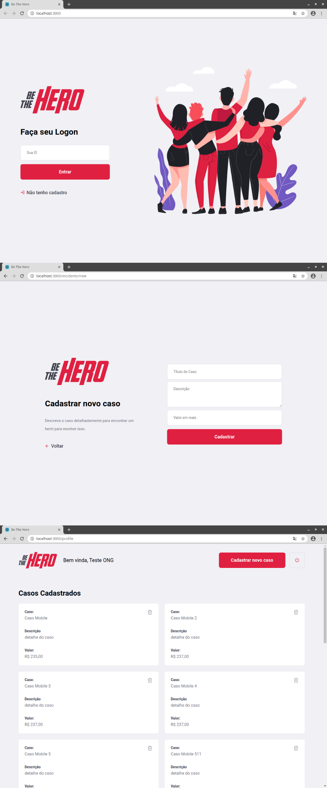

# Be The Hero

Repositório com o código da aplicação web e mobile criada na semana omnistack 11

## Mobile App (React Native)

### Tecnologias:

 - react-navigation
 - axios
 - expo
 - intl
 - react
 - react-native

## WebApp (React):

### Tecnologias:

- axios
- react
- react-dom
- react-icons
- react-router-dom

## WebService (nodeJS):
API desenvolvida para servir od dados para a aplicação web e mobile.

### Tecnologias:

- celebrate
- cors
- cross-env
- express
- knex
- sqlite3
